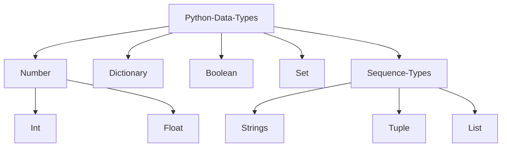

### Data types



## [Python List](https://docs.python.org/3/tutorial/datastructures.html#more-on-lists)

List in python is represents as an array.
If you need to consistently add and remove from beginning of list consider deque.
As this will shift the entire array, costing more time.

> [!info]+ Time Complexity of List
>
> | Operation | Average Case | Amortized Worst Case |
> | :-------: | :----------: | :------------------: |
> | append()  |     O(1)     |         O(1)         |
> | insert()  |     O(n)     |         O(n)         |
> |  sort()   |   O(nlogn)   |       O(nlogn)       |
> |   pop()   |     O(1)     |         O(1)         |
> |  pop(4)   |     O(n)     |         O(n)         |
> | remove()  |     O(n)     |         O(n)         |

```python
nums = [1,2,3]

nums.index(1)   # returns the index
nums.append(1)  # appends 1
nums.remove(3)  # removes all instances of 3
nums.copy(1)    # returns copy of the list
nums.count(1)   # returns no.of times '1' is present in the list
nums.pop()      # pops last element, [can select item too]
nums.reverse()  # reverses original list (nums in this case)
nums.sort()     # sorts list [does NOT return sorted list]
nums.insert(0,1)# inserts 10 at 0th index
nums.extend(someOtherList) # ...
```

```python
# Python strides
a[start:stop]  # items start through stop-1
a[start:]      # items start through the rest of the array
a[:stop]       # items from the beginning through stop-1
a[:]           # a copy of the whole array

```

```python
# List as Stacks
nums = [1,2,3]
nums.append(4)
nums.append(4)
nums.pop()
```

## [Dictionary](https://docs.python.org/3/tutorial/datastructures.html#dictionaries)

Dictionary are indexed by ==keys== and are **immutable**. **Tuples** may be used
as keys as long as they are strings or numbers, if tuple contains **mutable**
object, it cannot be used as a key. Initialized with `{}`.

> [!info]+ Time Complexity of Dictionary
>
> | Operation | Average Case | Amortized Worst Case |
> | :-------: | :----------: | :------------------: |
> |  k in d   |     O(1)     |         O(n)         |
> |   get()   |     O(1)     |         O(n)         |
> |   set[]   |     O(1)     |         O(n)         |
> |    del    |     O(1)     |         O(n)         |

```python
dict = {'a':1,'b':2,'c':3}

dict.keys()     # returns list of keys of dictionary
dict.values()   # returns list of values of dictionary
dict.get('a')   # returns value for any corresponding key
dict.items()    # returns [('a',1),('b',2),('c',3)]
dict.copy()     # returns copy of the dictionary

dict.pop(key)   # pops key-value pair with that key
dict.popitem()  # removes most recent pair added
dict.setDefault(key,default_value)

# if key doesn't exist, it will create it and won't throw an error
myDictionary = defaultdict(list)
```

[counter](https://docs.python.org/3/library/collections.html#counter-objects) object is a sub class of dictionary that counts the frequency of elements
in the container. You can assign it to a variable to create a new dict, then
you'll be able to update and delete it like any other dictionary.

```python
from collections import Counter

list1 = ['x','y','z','x','x','x','y', 'z']

# Initialization
Counter(list1) # => Counter({'x': 4, 'y': 2, 'z': 2})
Counter("Welcome to Guru99 Tutorials!") # => Counter({'o': 3, 'u': 3, 'e': 2, ...})
```

## Deque

A double-ended queue allows you to remove and add elements from either ends.

> [!info]+ Time Complexity of deque
>
> |  Operation   | Average Case | Amortized Worst Case |
> | :----------: | :----------: | :------------------: |
> |    copy()    |     O(n)     |         O(n)         |
> |   append()   |     O(1)     |         O(1)         |
> | appendleft() |     O(1)     |         O(1)         |
> |    pop()     |     O(1)     |         O(1)         |
> |  popleft()   |     O(1)     |         O(1)         |
> |   extend()   |     O(k)     |         O(k)         |
> | extendleft() |     O(k)     |         O(k)         |
