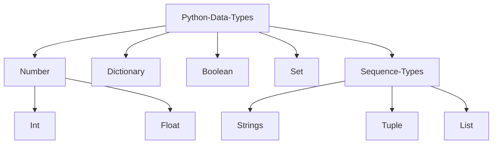

## Data types



## [Python List](https://docs.python.org/3/tutorial/datastructures.html#more-on-lists)

List in python is represents as an array.
If you need to consistently add and remove from beginning of list consider deque.
As this will shift the entire array, costing more time.

> [!info]+ Time Complexity of List
>
> | Operation | Average Case | Amortized Worst Case |
> | :-------: | :----------: | :------------------: |
> | append()  |     O(1)     |         O(1)         |
> | insert()  |     O(n)     |         O(n)         |
> |  sort()   |   O(nlogn)   |       O(nlogn)       |
> |   pop()   |     O(1)     |         O(1)         |
> |  pop(4)   |     O(n)     |         O(n)         |
> | remove()  |     O(n)     |         O(n)         |

```python
nums = [1,2,3]

nums.index(1)   # returns the index
nums.append(1)  # appends 1
nums.remove(3)  # removes all instances of 3
nums.copy(1)    # returns copy of the list
nums.count(1)   # returns no.of times '1' is present in the list
nums.pop()      # pops last element, [can select item too]
nums.reverse()  # reverses original list (nums in this case)
nums.sort()     # sorts list [does NOT return sorted list]
nums.insert(0,1)# inserts 10 at 0th index
nums.extend(someOtherList) # ...
```

```python
# Python strides
a[start:stop]  # items start through stop-1
a[start:]      # items start through the rest of the array
a[:stop]       # items from the beginning through stop-1
a[:]           # a copy of the whole array

```

```python
# List as Stacks
nums = [1,2,3]
nums.append(4)
nums.append(4)
nums.pop()
```

## [Dictionary](https://docs.python.org/3/tutorial/datastructures.html#dictionaries)

Dictionary are indexed by ==keys== and are **immutable**. **Tuples** may be used
as keys as long as they are strings or numbers, if tuple contains **mutable**
object, it cannot be used as a key. Initialized with `{}`.

> [!info]+ Time Complexity of Dictionary
>
> | Operation | Average Case | Amortized Worst Case |
> | :-------: | :----------: | :------------------: |
> |  k in d   |     O(1)     |         O(n)         |
> |   get()   |     O(1)     |         O(n)         |
> |   set[]   |     O(1)     |         O(n)         |
> |    del    |     O(1)     |         O(n)         |

```python
from collections import defaultdict
dict = {'a':1,'b':2,'c':3}

dict.keys()     # returns list of keys of dictionary
dict.values()   # returns list of values of dictionary
dict.get('a')   # returns value for any corresponding key
dict.items()    # returns [('a',1),('b',2),('c',3)]
dict.copy()     # returns copy of the dictionary

dict.pop(key)   # pops key-value pair with that key
dict.popitem()  # removes most recent pair added
dict.setDefault(key,default_value)

# if key doesn't exist, it will create it and won't throw an error
myDictionary = defaultdict(list)

# sorting by key `0` or value `1`
diction = dict(sorted(dict.items(), key=lambda v: v[0], reverse=True))

# iterate with for loop (unpacking)
for k, v in diction.items():
    ...
```

[counter](https://docs.python.org/3/library/collections.html#counter-objects) object is a sub class of dictionary that counts the frequency of elements
in the container. You can assign it to a variable to create a new dict, then
you'll be able to update and delete it like any other dictionary.

```python
from collections import Counter

list1 = ['x','y','z','x','x','x','y', 'z']

# Initialization
c = Counter(list1) # => Counter({'x': 4, 'y': 2, 'z': 2})
Counter("Welcome to Guru99 Tutorials!") # => Counter({'o': 3, 'u': 3, 'e': 2, ...})

s = sorted(c.keys())    # sorted by key -> returns arr of keys
s = sorted(c.values())  # sorted by values -> returns arr of values
s = sorted(c.items())   # sorted by keys -> returns arr of tuples
```

## [Deque](https://docs.python.org/3/library/collections.html#deque-objects)

A double-ended queue allows you to remove and add elements from either ends.

> [!info]+ Time Complexity of deque
>
> |  Operation   | Average Case | Amortized Worst Case |
> | :----------: | :----------: | :------------------: |
> |    copy()    |     O(n)     |         O(n)         |
> |   append()   |     O(1)     |         O(1)         |
> | appendleft() |     O(1)     |         O(1)         |
> |    pop()     |     O(1)     |         O(1)         |
> |  popleft()   |     O(1)     |         O(1)         |
> |   extend()   |     O(k)     |         O(k)         |
> | extendleft() |     O(k)     |         O(k)         |

```python
from collections import deque

queue = deque(['name','age','DOB'])

queue.append("append_from_right")   # Append from right
queue.pop()     # Pop from right

queue.appendleft("fromLeft")        # Append from left
queue.popleft() # Pop from left

queue.index(element,begin_index,end_index)  # Returns position of first match of element.
queue.insert(index,element)
queue.remove()  # removes first occurrance
queue.count()

queue.reverse() # reverses order of queue elements
```

## [Heapq](https://docs.python.org/3/library/heapq.html#module-heapq)

In python we access a [[priority-queue |priority queue]] implemented using a [[heaps |heap]] with **heapq** library.

Using `heaps.heaify()` can reduce **time** and **space** complexity since it operations
is done in-place.

```python
import heapq    # (minHeap by Default)

nums = [5, 7, 9, 1, 3]

heapq.heapify(nums) # converts list into heap. Can be converted back to list by list(nums).
heapq.heappush(nums,element) # Push an element into the heap
heapq.heappop(nums) # Pop an element from the heap
#heappush(heap, ele) :- This function is used to insert the element mentioned in its arguments into heap. The order is adjusted, so as heap structure is maintained.
#heappop(heap) :- This function is used to remove and return the smallest element from heap. The order is adjusted, so as heap structure is maintained.

heapq.nlargest(k, iterable, key = fun)
heapq.nsmallest(k, iterable, key = fun)
```

## [Sets](https://docs.python.org/3/library/stdtypes.html#set)

A set is a collection which is unordered, immutable, unindexed, and contains no duplicates.

```python
set = {1,2,3}

set.add(item)
set.remove(item)
set.discard(item) | set.remove(item) # removes item | remove will throw error if item is not there, discard will not
set.pop() # removes random item (since unordered)

set.isdisjoint(anotherSet)  # returns true if no common elements
set.issubset(anotherSet)    # returns true if all elements from anotherSet is present in original set
set.issuperset(anotherSet)  # returns true if all elements from original set is present in anotherSet

set.difference(anotherSet)          # returns set of items ONLY in first set
set.difference_update(anotherSet)   # removes common elements from first set
set.intersection(anotherSet)        # returns new set with common elements
set.intersection_update(anotherSet) # modifies set keeping only common elements
set.symmetric_difference(anotherSet) # returns set of all non-common elements of both sets
set.symmetric_difference_update(anotherSet) # same as symmetric_difference but changes are made on original set

set.union(anotherSet)   # ...
set.update(anotherSet)  # adds anotherSet without duplicate
```

## [Tuples](https://docs.python.org/3/library/stdtypes.html#tuples)

Tuples are immutable sequences, typically used to store collections of heterogeneous data.
Such as allowing storage in a set or dict instance.

```python
tuple = (1,2,3,1)

tuple.count(1) # returns occurence of an item
tuple.index(1) # returns index of first 1 in array
```

## [Strings](https://docs.python.org/3/library/stdtypes.html#string-methods)

Some methods of the string class.

```python
s = "Hello World!"

s.join("!!")    # Hello World!!!
for "Wor" in s  # returns boolean

s.isnumeric()   # returns true or false
s.isdecimal()   # returns true or false
s.isdigit()     # returns true of false

s=list(s)       # Output: ["Hello", "World!!"]

s.find("Wor"[, start[, end]])   # return index of sub string, otherwise -1
s.index("Wor"[, start[, end]])  # like find() but throws error if not found
```
